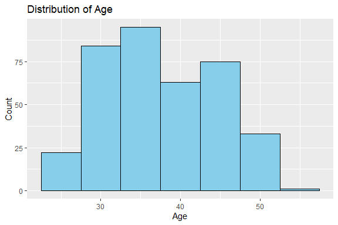
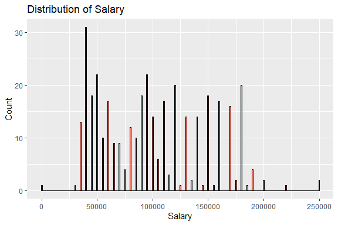
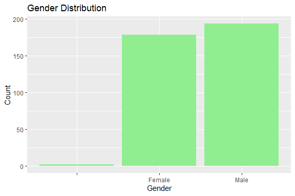
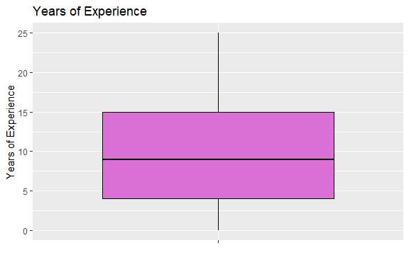
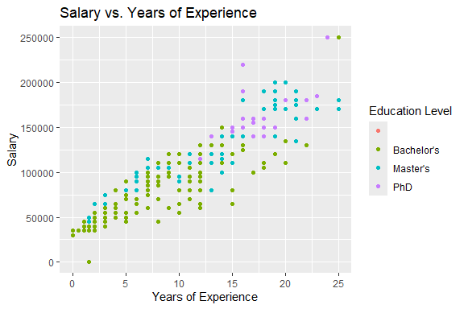
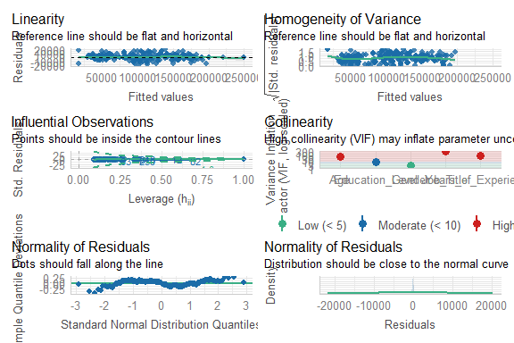

Salary Prediction
================
Trevor Okinda
2024

- [Student Details](#student-details)
- [Setup Chunk](#setup-chunk)
  - [Source:](#source)
  - [Reference:](#reference)
- [Understanding the Dataset (Exploratory Data Analysis
  (EDA))](#understanding-the-dataset-exploratory-data-analysis-eda)
  - [Load dataset](#load-dataset)
  - [Measures of Frequency](#measures-of-frequency)
  - [Measures of Central Tendency](#measures-of-central-tendency)
  - [Measures of Relationship](#measures-of-relationship)
  - [ANOVA](#anova)
  - [Plots](#plots)
- [Preprocessing and Data
  Transformation](#preprocessing-and-data-transformation)
  - [Missing Values](#missing-values)
  - [Remove Missing Values](#remove-missing-values)
- [Model Training](#model-training)
  - [Data Splitting](#data-splitting)
  - [Bootstrapping](#bootstrapping)
  - [Cross-validation](#cross-validation)
  - [Model Training](#model-training-1)
  - [Stats](#stats)
- [Saving Model](#saving-model)

# Student Details

|                       |                         |
|-----------------------|-------------------------|
| **Student ID Number** | 134780                  |
| **Student Name**      | Trevor Okinda           |
| **BBIT 4.2 Group**    | C                       |
| **Project Name**      | Salary Prediction Model |

# Setup Chunk

**Note:** the following KnitR options have been set as the global
defaults: <BR>
`knitr::opts_chunk$set(echo = TRUE, warning = FALSE, eval = TRUE, collapse = FALSE, tidy = TRUE)`.

More KnitR options are documented here
<https://bookdown.org/yihui/rmarkdown-cookbook/chunk-options.html> and
here <https://yihui.org/knitr/options/>.

### Source:

The dataset that was used can be downloaded here: *\<<a
href="https://www.kaggle.com/datasets/mrsimple07/salary-prediction-data\"
class="uri">https://www.kaggle.com/datasets/mrsimple07/salary-prediction-data\</a>\>*

### Reference:

*\<mrsimple07. (n.d.). Salary Prediction Data \[Data set\]. Kaggle. <a
href="https://www.kaggle.com/datasets/mrsimple07/salary-prediction-data\"
class="uri">https://www.kaggle.com/datasets/mrsimple07/salary-prediction-data\</a>\>  
Refer to the APA 7th edition manual for rules on how to cite datasets:
<https://apastyle.apa.org/style-grammar-guidelines/references/examples/data-set-references>*

# Understanding the Dataset (Exploratory Data Analysis (EDA))

## Load dataset

``` r
# Load dataset
employee_salary_data <- read.csv("Salary_Data.csv", colClasses = c(
  Age = "numeric",
  Gender = "factor",
  Education_Level = "factor",
  Job_Title = "character",
  Years_of_Experience = "numeric",
  Salary = "numeric"
))

# Display the structure of the dataset
str(employee_salary_data)
```

    ## 'data.frame':    375 obs. of  6 variables:
    ##  $ Age                : num  32 28 45 36 52 29 42 31 26 38 ...
    ##  $ Gender             : Factor w/ 3 levels "","Female","Male": 3 2 3 2 3 3 2 3 2 3 ...
    ##  $ Education_Level    : Factor w/ 4 levels "","Bachelor's",..: 2 3 4 2 3 2 3 2 2 4 ...
    ##  $ Job_Title          : chr  "Software Engineer" "Data Analyst" "Senior Manager" "Sales Associate" ...
    ##  $ Years_of_Experience: num  5 3 15 7 20 2 12 4 1 10 ...
    ##  $ Salary             : num  90000 65000 150000 60000 200000 55000 120000 80000 45000 110000 ...

``` r
# View the first few rows of the dataset
head(employee_salary_data)
```

    ##   Age Gender Education_Level         Job_Title Years_of_Experience Salary
    ## 1  32   Male      Bachelor's Software Engineer                   5  90000
    ## 2  28 Female        Master's      Data Analyst                   3  65000
    ## 3  45   Male             PhD    Senior Manager                  15 150000
    ## 4  36 Female      Bachelor's   Sales Associate                   7  60000
    ## 5  52   Male        Master's          Director                  20 200000
    ## 6  29   Male      Bachelor's Marketing Analyst                   2  55000

``` r
# View the dataset in a separate viewer window
View(employee_salary_data)
```

## Measures of Frequency

``` r
# Measures of Frequency
gender_frequency <- table(employee_salary_data$Gender)
education_frequency <- table(employee_salary_data$Education_Level)
job_title_frequency <- table(employee_salary_data$Job_Title)

# Display frequency tables
print("Frequency of Gender:")
```

    ## [1] "Frequency of Gender:"

``` r
print(gender_frequency)
```

    ## 
    ##        Female   Male 
    ##      2    179    194

``` r
print("Frequency of Education Level:")
```

    ## [1] "Frequency of Education Level:"

``` r
print(education_frequency)
```

    ## 
    ##            Bachelor's   Master's        PhD 
    ##          2        224         98         51

``` r
print("Frequency of Job Title:")
```

    ## [1] "Frequency of Job Title:"

``` r
print(job_title_frequency)
```

    ## 
    ##                                                             Account Manager 
    ##                                     2                                     1 
    ##                            Accountant              Administrative Assistant 
    ##                                     1                                     2 
    ##                      Business Analyst          Business Development Manager 
    ##                                     2                                     1 
    ##         Business Intelligence Analyst                                   CEO 
    ##                                     1                                     1 
    ##                    Chief Data Officer              Chief Technology Officer 
    ##                                     1                                     1 
    ##             Content Marketing Manager                            Copywriter 
    ##                                     1                                     1 
    ##                     Creative Director              Customer Service Manager 
    ##                                     1                                     2 
    ##                  Customer Service Rep       Customer Service Representative 
    ##                                     1                                     1 
    ##              Customer Success Manager                  Customer Success Rep 
    ##                                     1                                     1 
    ##                          Data Analyst                      Data Entry Clerk 
    ##                                     2                                     1 
    ##                        Data Scientist              Digital Content Producer 
    ##                                     1                                     1 
    ##             Digital Marketing Manager                              Director 
    ##                                     1                                     1 
    ##      Director of Business Development               Director of Engineering 
    ##                                     1                                     2 
    ##                   Director of Finance                        Director of HR 
    ##                                     2                                     1 
    ##             Director of Human Capital           Director of Human Resources 
    ##                                     1                                     2 
    ##                 Director of Marketing                Director of Operations 
    ##                                    12                                    11 
    ##        Director of Product Management                     Director of Sales 
    ##                                     1                                     1 
    ##       Director of Sales and Marketing                     Event Coordinator 
    ##                                     1                                     2 
    ##                     Financial Advisor                     Financial Analyst 
    ##                                     1                                     1 
    ##                     Financial Manager                      Graphic Designer 
    ##                                     1                                     1 
    ##                     Help Desk Analyst                         HR Generalist 
    ##                                     1                                     2 
    ##                            HR Manager              Human Resources Director 
    ##                                     2                                     1 
    ##                            IT Manager                            IT Support 
    ##                                     1                                     1 
    ##                 IT Support Specialist                Junior Account Manager 
    ##                                     1                                     2 
    ##                     Junior Accountant        Junior Advertising Coordinator 
    ##                                     3                                     1 
    ##               Junior Business Analyst Junior Business Development Associate 
    ##                                     8                                     7 
    ##    Junior Business Operations Analyst                     Junior Copywriter 
    ##                                     2                                     1 
    ##    Junior Customer Support Specialist                   Junior Data Analyst 
    ##                                     1                                     1 
    ##                 Junior Data Scientist                       Junior Designer 
    ##                                     1                                     1 
    ##                      Junior Developer              Junior Financial Advisor 
    ##                                     1                                     1 
    ##              Junior Financial Analyst                 Junior HR Coordinator 
    ##                                     7                                     2 
    ##                  Junior HR Generalist              Junior Marketing Analyst 
    ##                                     2                                     3 
    ##          Junior Marketing Coordinator              Junior Marketing Manager 
    ##                                     6                                     3 
    ##           Junior Marketing Specialist             Junior Operations Analyst 
    ##                                     5                                     5 
    ##         Junior Operations Coordinator             Junior Operations Manager 
    ##                                     1                                     3 
    ##                Junior Product Manager                Junior Project Manager 
    ##                                     4                                     5 
    ##                      Junior Recruiter             Junior Research Scientist 
    ##                                     1                                     1 
    ##           Junior Sales Representative           Junior Social Media Manager 
    ##                                     4                                     1 
    ##        Junior Social Media Specialist             Junior Software Developer 
    ##                                     1                                     2 
    ##              Junior Software Engineer                    Junior UX Designer 
    ##                                     1                                     1 
    ##                   Junior Web Designer                  Junior Web Developer 
    ##                                     1                                     1 
    ##                     Marketing Analyst                 Marketing Coordinator 
    ##                                     2                                     3 
    ##                     Marketing Manager                  Marketing Specialist 
    ##                                     1                                     1 
    ##                      Network Engineer                        Office Manager 
    ##                                     1                                     1 
    ##                    Operations Analyst                   Operations Director 
    ##                                     1                                     1 
    ##                    Operations Manager                    Principal Engineer 
    ##                                     2                                     1 
    ##                   Principal Scientist                      Product Designer 
    ##                                     1                                     1 
    ##                       Product Manager             Product Marketing Manager 
    ##                                     2                                     1 
    ##                      Project Engineer                       Project Manager 
    ##                                     1                                     2 
    ##              Public Relations Manager                             Recruiter 
    ##                                     1                                     2 
    ##                     Research Director                    Research Scientist 
    ##                                     1                                     1 
    ##                       Sales Associate                        Sales Director 
    ##                                     2                                     1 
    ##                       Sales Executive                         Sales Manager 
    ##                                     1                                     3 
    ##              Sales Operations Manager                  Sales Representative 
    ##                                     1                                     1 
    ##              Senior Account Executive                Senior Account Manager 
    ##                                     1                                     1 
    ##                     Senior Accountant               Senior Business Analyst 
    ##                                     2                                    10 
    ##   Senior Business Development Manager                     Senior Consultant 
    ##                                     4                                     1 
    ##                   Senior Data Analyst                  Senior Data Engineer 
    ##                                     3                                     4 
    ##                 Senior Data Scientist                       Senior Engineer 
    ##                                     7                                     2 
    ##              Senior Financial Advisor              Senior Financial Analyst 
    ##                                     3                                     7 
    ##              Senior Financial Manager               Senior Graphic Designer 
    ##                                     5                                     1 
    ##                  Senior HR Generalist                     Senior HR Manager 
    ##                                     1                                     3 
    ##                  Senior HR Specialist    Senior Human Resources Coordinator 
    ##                                     1                                     1 
    ##        Senior Human Resources Manager     Senior Human Resources Specialist 
    ##                                     2                                     1 
    ##                  Senior IT Consultant             Senior IT Project Manager 
    ##                                     2                                     1 
    ##          Senior IT Support Specialist                        Senior Manager 
    ##                                     1                                     2 
    ##              Senior Marketing Analyst          Senior Marketing Coordinator 
    ##                                     9                                     3 
    ##             Senior Marketing Director              Senior Marketing Manager 
    ##                                     1                                     9 
    ##           Senior Marketing Specialist             Senior Operations Analyst 
    ##                                     4                                     2 
    ##         Senior Operations Coordinator             Senior Operations Manager 
    ##                                     4                                     5 
    ##               Senior Product Designer    Senior Product Development Manager 
    ##                                     5                                     1 
    ##                Senior Product Manager      Senior Product Marketing Manager 
    ##                                     6                                     1 
    ##            Senior Project Coordinator                Senior Project Manager 
    ##                                     5                                     7 
    ##      Senior Quality Assurance Analyst             Senior Research Scientist 
    ##                                     1                                     1 
    ##                     Senior Researcher                  Senior Sales Manager 
    ##                                     1                                     2 
    ##           Senior Sales Representative                      Senior Scientist 
    ##                                     2                                     3 
    ##             Senior Software Architect             Senior Software Developer 
    ##                                     1                                     3 
    ##              Senior Software Engineer            Senior Training Specialist 
    ##                                     6                                     1 
    ##                    Senior UX Designer                  Social Media Manager 
    ##                                     3                                     1 
    ##               Social Media Specialist                    Software Developer 
    ##                                     1                                     1 
    ##                     Software Engineer                      Software Manager 
    ##                                     1                                     1 
    ##              Software Project Manager                   Strategy Consultant 
    ##                                     1                                     1 
    ##                  Supply Chain Analyst                  Supply Chain Manager 
    ##                                     1                                     1 
    ##                   Technical Recruiter          Technical Support Specialist 
    ##                                     1                                     1 
    ##                      Technical Writer                   Training Specialist 
    ##                                     1                                     1 
    ##                           UX Designer                         UX Researcher 
    ##                                     1                                     1 
    ##                         VP of Finance                      VP of Operations 
    ##                                     1                                     1 
    ##                         Web Developer 
    ##                                     1

## Measures of Central Tendency

``` r
# Measures of Central Tendency
age_mean <- mean(employee_salary_data$Age)
age_median <- median(employee_salary_data$Age)
years_of_exp_mean <- mean(employee_salary_data$Years_of_Experience)
years_of_exp_median <- median(employee_salary_data$Years_of_Experience)
salary_mean <- mean(employee_salary_data$Salary)
salary_median <- median(employee_salary_data$Salary)

# Display measures of central tendency
print("Measures of Central Tendency:")
```

    ## [1] "Measures of Central Tendency:"

``` r
print(paste("Mean Age:", age_mean))
```

    ## [1] "Mean Age: NA"

``` r
print(paste("Median Age:", age_median))
```

    ## [1] "Median Age: NA"

``` r
print(paste("Mean Years of Experience:", years_of_exp_mean))
```

    ## [1] "Mean Years of Experience: NA"

``` r
print(paste("Median Years of Experience:", years_of_exp_median))
```

    ## [1] "Median Years of Experience: NA"

``` r
print(paste("Mean Salary:", salary_mean))
```

    ## [1] "Mean Salary: NA"

``` r
print(paste("Median Salary:", salary_median))
```

    ## [1] "Median Salary: NA"

## Measures of Relationship

``` r
# Measures of Relationship
correlation_matrix <- cor(employee_salary_data[c("Age", "Years_of_Experience", "Salary")])

# Display correlation matrix
print("Correlation Matrix:")
```

    ## [1] "Correlation Matrix:"

``` r
print(correlation_matrix)
```

    ##                     Age Years_of_Experience Salary
    ## Age                   1                  NA     NA
    ## Years_of_Experience  NA                   1     NA
    ## Salary               NA                  NA      1

## ANOVA

``` r
# Perform the one-way ANOVA test
anova_result <- aov(Salary ~ Education_Level, data = employee_salary_data)

# Print the ANOVA summary
summary(anova_result)
```

    ##                  Df    Sum Sq   Mean Sq F value Pr(>F)    
    ## Education_Level   2 4.003e+11 2.001e+11   159.1 <2e-16 ***
    ## Residuals       370 4.654e+11 1.258e+09                   
    ## ---
    ## Signif. codes:  0 '***' 0.001 '**' 0.01 '*' 0.05 '.' 0.1 ' ' 1
    ## 2 observations deleted due to missingness

## Plots

``` r
library(ggplot2)

# Assuming employee_salary_data is already loaded
ggplot(employee_salary_data, aes(x = Age)) +
  geom_histogram(binwidth = 5, fill = "skyblue", color = "black") +
  labs(title = "Distribution of Age", x = "Age", y = "Count")
```

<!-- -->

``` r
ggplot(employee_salary_data, aes(x = Salary)) +
  geom_histogram(binwidth = 1000, fill = "salmon", color = "black") +
  labs(title = "Distribution of Salary", x = "Salary", y = "Count")
```

<!-- -->

``` r
ggplot(employee_salary_data, aes(x = Gender)) +
  geom_bar(fill = "lightgreen") +
  labs(title = "Gender Distribution", x = "Gender", y = "Count")
```

<!-- -->

``` r
ggplot(employee_salary_data, aes(x = "", y = Years_of_Experience)) +
  geom_boxplot(fill = "orchid", color = "black") +
  labs(title = "Years of Experience", x = "", y = "Years of Experience")
```

<!-- -->

``` r
ggplot(employee_salary_data, aes(x = Years_of_Experience, y = Salary, color = Education_Level)) +
  geom_point() +
  labs(title = "Salary vs. Years of Experience",
       x = "Years of Experience", y = "Salary",
       color = "Education Level")
```

<!-- -->

# Preprocessing and Data Transformation

## Missing Values

``` r
# Check for missing values
missing_values <- sapply(employee_salary_data, function(x) sum(is.na(x)))
print(missing_values)
```

    ##                 Age              Gender     Education_Level           Job_Title 
    ##                   2                   0                   0                   0 
    ## Years_of_Experience              Salary 
    ##                   2                   2

## Remove Missing Values

``` r
# Assuming the dataset is already loaded into R as "employee_salary_data"

# Remove rows with missing values
employee_salary_data_clean <- na.omit(employee_salary_data)

# Check for missing values again
missing_values_clean <- sapply(employee_salary_data_clean, function(x) sum(is.na(x)))
print(missing_values_clean)
```

    ##                 Age              Gender     Education_Level           Job_Title 
    ##                   0                   0                   0                   0 
    ## Years_of_Experience              Salary 
    ##                   0                   0

# Model Training

## Data Splitting

``` r
library(caret)
```

    ## Loading required package: lattice

``` r
set.seed(42)  # For reproducibility
#data splitting
train_indices <- sample(1:nrow(employee_salary_data_clean), 0.8 * nrow(employee_salary_data_clean))
train_data <- employee_salary_data_clean[train_indices, ]
test_data <- employee_salary_data_clean[-train_indices, ]

dim(train_data)
```

    ## [1] 298   6

``` r
dim(test_data)
```

    ## [1] 75  6

## Bootstrapping

``` r
#Bootstrapping
library(boot)
```

    ## 
    ## Attaching package: 'boot'

    ## The following object is masked from 'package:lattice':
    ## 
    ##     melanoma

``` r
n_bootstraps <- 1000
bootstrap_scores <- numeric(n_bootstraps)
for (i in 1:n_bootstraps) {
  boot_indices <- sample(1:nrow(train_data), replace = TRUE)
  boot_train_data <- train_data[boot_indices, ]
  model <- lm(Salary ~ ., data = boot_train_data)
  bootstrap_scores[i] <- summary(model)$r.squared
}
average_bootstrap_score <- mean(bootstrap_scores)
print(paste("Average bootstrap score:", round(average_bootstrap_score, 4)))
```

    ## [1] "Average bootstrap score: 0.9897"

## Cross-validation

``` r
library(caret)  # For cross-validation
model_cv <- train(Salary ~ ., data = train_data, method = "lm",
                  trControl = trainControl(method = "cv", number = 5))
cv_scores <- model_cv$results$RMSE
print(paste("Cross-validation scores:", cv_scores))
```

    ## [1] "Cross-validation scores: 18833.1017280831"

``` r
print(paste("Mean cross-validation RMSE:", mean(cv_scores)))
```

    ## [1] "Mean cross-validation RMSE: 18833.1017280831"

``` r
print(model_cv)
```

    ## Linear Regression 
    ## 
    ## 298 samples
    ##   5 predictor
    ## 
    ## No pre-processing
    ## Resampling: Cross-Validated (5 fold) 
    ## Summary of sample sizes: 239, 239, 238, 238, 238 
    ## Resampling results:
    ## 
    ##   RMSE     Rsquared   MAE     
    ##   18833.1  0.8587024  12737.32
    ## 
    ## Tuning parameter 'intercept' was held constant at a value of TRUE

## Model Training

``` r
# Model Training

# Split the data into features (X) and target (y)
X <- employee_salary_data_clean[, c("Age", "Gender", "Education_Level", "Job_Title", "Years_of_Experience")]
y <- employee_salary_data_clean$Salary

# Encode categorical variables (Gender and Education_Level)
X$Gender <- as.numeric(X$Gender == "Male")
X$Education_Level <- as.numeric(X$Education_Level)

# Model training using Linear Regression
lm_model <- lm(y ~ ., data = X)
print("Linear Regression Model:")
```

    ## [1] "Linear Regression Model:"

``` r
print(lm_model)
```

    ## 
    ## Call:
    ## lm(formula = y ~ ., data = X)
    ## 
    ## Coefficients:
    ##                                    (Intercept)  
    ##                                       -18657.5  
    ##                                            Age  
    ##                                         2306.1  
    ##                                         Gender  
    ##                                          817.9  
    ##                                Education_Level  
    ##                                         5969.3  
    ##                            Job_TitleAccountant  
    ##                                       -15454.7  
    ##              Job_TitleAdministrative Assistant  
    ##                                       -42551.0  
    ##                      Job_TitleBusiness Analyst  
    ##                                        -4956.2  
    ##          Job_TitleBusiness Development Manager  
    ##                                          154.4  
    ##         Job_TitleBusiness Intelligence Analyst  
    ##                                        -1118.1  
    ##                                   Job_TitleCEO  
    ##                                       105063.2  
    ##                    Job_TitleChief Data Officer  
    ##                                        89753.4  
    ##              Job_TitleChief Technology Officer  
    ##                                        89933.8  
    ##             Job_TitleContent Marketing Manager  
    ##                                       -11727.3  
    ##                            Job_TitleCopywriter  
    ##                                       -20693.7  
    ##                     Job_TitleCreative Director  
    ##                                         3995.5  
    ##              Job_TitleCustomer Service Manager  
    ##                                       -14762.8  
    ##                  Job_TitleCustomer Service Rep  
    ##                                       -19205.5  
    ##       Job_TitleCustomer Service Representative  
    ##                                       -26876.1  
    ##              Job_TitleCustomer Success Manager  
    ##                                       -21511.6  
    ##                  Job_TitleCustomer Success Rep  
    ##                                       -14660.2  
    ##                          Job_TitleData Analyst  
    ##                                       -17680.8  
    ##                      Job_TitleData Entry Clerk  
    ##                                       -15932.8  
    ##                        Job_TitleData Scientist  
    ##                                         3791.7  
    ##              Job_TitleDigital Content Producer  
    ##                                       -16727.3  
    ##             Job_TitleDigital Marketing Manager  
    ##                                       -11094.7  
    ##                              Job_TitleDirector  
    ##                                        51588.7  
    ##      Job_TitleDirector of Business Development  
    ##                                        34540.4  
    ##               Job_TitleDirector of Engineering  
    ##                                        43151.1  
    ##                   Job_TitleDirector of Finance  
    ##                                        35068.8  
    ##                        Job_TitleDirector of HR  
    ##                                        41630.8  
    ##             Job_TitleDirector of Human Capital  
    ##                                        37903.3  
    ##           Job_TitleDirector of Human Resources  
    ##                                        36385.2  
    ##                 Job_TitleDirector of Marketing  
    ##                                        38885.3  
    ##                Job_TitleDirector of Operations  
    ##                                        31169.8  
    ##        Job_TitleDirector of Product Management  
    ##                                        34391.6  
    ##                     Job_TitleDirector of Sales  
    ##                                        44152.5  
    ##       Job_TitleDirector of Sales and Marketing  
    ##                                        28206.6  
    ##                     Job_TitleEvent Coordinator  
    ##                                       -34728.2  
    ##                     Job_TitleFinancial Advisor  
    ##                                         3129.5  
    ##                     Job_TitleFinancial Analyst  
    ##                                       -18339.6  
    ##                     Job_TitleFinancial Manager  
    ##                                        26905.1  
    ##                      Job_TitleGraphic Designer  
    ##                                       -14421.2  
    ##                     Job_TitleHelp Desk Analyst  
    ##                                       -16750.6  
    ##                         Job_TitleHR Generalist  
    ##                                       -25393.8  
    ##                            Job_TitleHR Manager  
    ##                                        -6068.7  
    ##              Job_TitleHuman Resources Director  
    ##                                        41630.8  
    ##                            Job_TitleIT Manager  
    ##                                        -7184.3  
    ##                            Job_TitleIT Support  
    ##                                       -16123.7  
    ##                 Job_TitleIT Support Specialist  
    ##                                       -27067.0  
    ##                Job_TitleJunior Account Manager  
    ##                                       -16693.8  
    ##                     Job_TitleJunior Accountant  
    ##                                       -19550.0  
    ##        Job_TitleJunior Advertising Coordinator  
    ##                                       -22545.1  
    ##               Job_TitleJunior Business Analyst  
    ##                                       -19474.1  
    ## Job_TitleJunior Business Development Associate  
    ##                                       -22737.6  
    ##    Job_TitleJunior Business Operations Analyst  
    ##                                       -45432.0  
    ##                     Job_TitleJunior Copywriter  
    ##                                       -21727.3  
    ##    Job_TitleJunior Customer Support Specialist  
    ##                                       -21899.5  
    ##                   Job_TitleJunior Data Analyst  
    ##                                       -27067.0  
    ##                 Job_TitleJunior Data Scientist  
    ##                                       -16340.2  
    ##                       Job_TitleJunior Designer  
    ##                                       -22999.8  
    ##                      Job_TitleJunior Developer  
    ##                                       -10865.9  
    ##              Job_TitleJunior Financial Advisor  
    ##                                        -8578.6  
    ##              Job_TitleJunior Financial Analyst  
    ##                                       -18327.2  
    ##                 Job_TitleJunior HR Coordinator  
    ##                                       -22880.3  
    ##                  Job_TitleJunior HR Generalist  
    ##                                       -20346.9  
    ##              Job_TitleJunior Marketing Analyst  
    ##                                       -15082.3  
    ##          Job_TitleJunior Marketing Coordinator  
    ##                                       -20911.9  
    ##              Job_TitleJunior Marketing Manager  
    ##                                       -12465.9  
    ##           Job_TitleJunior Marketing Specialist  
    ##                                       -15838.2  
    ##             Job_TitleJunior Operations Analyst  
    ##                                       -19695.9  
    ##         Job_TitleJunior Operations Coordinator  
    ##                                       -25305.9  
    ##             Job_TitleJunior Operations Manager  
    ##                                       -15548.4  
    ##                Job_TitleJunior Product Manager  
    ##                                       -14888.4  
    ##                Job_TitleJunior Project Manager  
    ##                                       -19024.6  
    ##                      Job_TitleJunior Recruiter  
    ##                                       -19421.2  
    ##             Job_TitleJunior Research Scientist  
    ##                                       -13646.3  
    ##           Job_TitleJunior Sales Representative  
    ##                                       -23807.6  
    ##           Job_TitleJunior Social Media Manager  
    ##                                       -21727.3  
    ##        Job_TitleJunior Social Media Specialist  
    ##                                       -24033.3  
    ##             Job_TitleJunior Software Developer  
    ##                                       -23892.1  
    ##              Job_TitleJunior Software Engineer  
    ##                                       -21511.6  
    ##                    Job_TitleJunior UX Designer  
    ##                                       -18646.3  
    ##                   Job_TitleJunior Web Designer  
    ##                                       -20239.0  
    ##                  Job_TitleJunior Web Developer  
    ##                                       -27306.1  
    ##                     Job_TitleMarketing Analyst  
    ##                                       -12028.3  
    ##                 Job_TitleMarketing Coordinator  
    ##                                       -16906.1  
    ##                     Job_TitleMarketing Manager  
    ##                                         4699.7  
    ##                  Job_TitleMarketing Specialist  
    ##                                       -32431.5  
    ##                      Job_TitleNetwork Engineer  
    ##                                        -7545.1  
    ##                        Job_TitleOffice Manager  
    ##                                       -41844.5  
    ##                    Job_TitleOperations Analyst  
    ##                                       -16299.6  
    ##                   Job_TitleOperations Director  
    ##                                        53655.7  
    ##                    Job_TitleOperations Manager  
    ##                                        13418.6  
    ##                    Job_TitlePrincipal Engineer  
    ##                                        24843.6  
    ##                   Job_TitlePrincipal Scientist  
    ##                                        15308.9  
    ##                      Job_TitleProduct Designer  
    ##                                         5303.3  
    ##                       Job_TitleProduct Manager  
    ##                                        10554.0  
    ##             Job_TitleProduct Marketing Manager  
    ##                                         2848.4  
    ##                      Job_TitleProject Engineer  
    ##                                        -1822.4  
    ##                       Job_TitleProject Manager  
    ##                                         9985.2  
    ##              Job_TitlePublic Relations Manager  
    ##                                       -11094.7  
    ##                             Job_TitleRecruiter  
    ##                                       -28972.4  
    ##                     Job_TitleResearch Director  
    ##                                        57447.3  
    ##                    Job_TitleResearch Scientist  
    ##                                        14306.9  
    ##                       Job_TitleSales Associate  
    ##                                       -25335.2  
    ##                        Job_TitleSales Director  
    ##                                        37021.3  
    ##                       Job_TitleSales Executive  
    ##                                        23054.8  
    ##                         Job_TitleSales Manager  
    ##                                         -160.6  
    ##              Job_TitleSales Operations Manager  
    ##                                       -13456.8  
    ##                  Job_TitleSales Representative  
    ##                                       -21750.6  
    ##              Job_TitleSenior Account Executive  
    ##                                        -5274.3  
    ##                Job_TitleSenior Account Manager  
    ##                                         4576.9  
    ##                     Job_TitleSenior Accountant  
    ##                                        -6096.2  
    ##               Job_TitleSenior Business Analyst  
    ##                                        13766.1  
    ##   Job_TitleSenior Business Development Manager  
    ##                                        18597.9  
    ##                     Job_TitleSenior Consultant  
    ##                                        14298.7  
    ##                   Job_TitleSenior Data Analyst  
    ##                                        18541.0  
    ##                  Job_TitleSenior Data Engineer  
    ##                                        24009.3  
    ##                 Job_TitleSenior Data Scientist  
    ##                                        27161.7  
    ##                       Job_TitleSenior Engineer  
    ##                                         6303.7  
    ##              Job_TitleSenior Financial Advisor  
    ##                                         7148.4  
    ##              Job_TitleSenior Financial Analyst  
    ##                                        14173.6  
    ##              Job_TitleSenior Financial Manager  
    ##                                        12248.8  
    ##               Job_TitleSenior Graphic Designer  
    ##                                        -7425.9  
    ##                  Job_TitleSenior HR Generalist  
    ##                                        -2367.3  
    ##                     Job_TitleSenior HR Manager  
    ##                                        18517.3  
    ##                  Job_TitleSenior HR Specialist  
    ##                                        17962.0  
    ##    Job_TitleSenior Human Resources Coordinator  
    ##                                       -15125.4  
    ##        Job_TitleSenior Human Resources Manager  
    ##                                        16569.9  
    ##     Job_TitleSenior Human Resources Specialist  
    ##                                        10029.0  
    ##                  Job_TitleSenior IT Consultant  
    ##                                         9508.8  
    ##             Job_TitleSenior IT Project Manager  
    ##                                        16840.8  
    ##          Job_TitleSenior IT Support Specialist  
    ##                                        -5465.2  
    ##                        Job_TitleSenior Manager  
    ##                                        24162.2  
    ##              Job_TitleSenior Marketing Analyst  
    ##                                        -1163.2  
    ##          Job_TitleSenior Marketing Coordinator  
    ##                                        -1412.0  
    ##             Job_TitleSenior Marketing Director  
    ##                                        36068.1  
    ##              Job_TitleSenior Marketing Manager  
    ##                                        13885.0  
    ##           Job_TitleSenior Marketing Specialist  
    ##                                         8025.8  
    ##             Job_TitleSenior Operations Analyst  
    ##                                         -471.7  
    ##         Job_TitleSenior Operations Coordinator  
    ##                                        12232.8  
    ##             Job_TitleSenior Operations Manager  
    ##                                        14008.4  
    ##               Job_TitleSenior Product Designer  
    ##                                        18678.6  
    ##    Job_TitleSenior Product Development Manager  
    ##                                        19851.2  
    ##                Job_TitleSenior Product Manager  
    ##                                        25307.1  
    ##      Job_TitleSenior Product Marketing Manager  
    ##                                         1689.4  
    ##            Job_TitleSenior Project Coordinator  
    ##                                        -5960.5  
    ##                Job_TitleSenior Project Manager  
    ##                                        14871.0  
    ##      Job_TitleSenior Quality Assurance Analyst  
    ##                                        14702.4  
    ##             Job_TitleSenior Research Scientist  
    ##                                        14306.9  
    ##                     Job_TitleSenior Researcher  
    ##                                        12298.5  
    ##                  Job_TitleSenior Sales Manager  
    ##                                         7890.2  
    ##           Job_TitleSenior Sales Representative  
    ##                                        -6427.3  
    ##                      Job_TitleSenior Scientist  
    ##                                         7795.4  
    ##             Job_TitleSenior Software Architect  
    ##                                        21814.8  
    ##             Job_TitleSenior Software Developer  
    ##                                        14999.4  
    ##              Job_TitleSenior Software Engineer  
    ##                                        15387.4  
    ##            Job_TitleSenior Training Specialist  
    ##                                        -8549.6  
    ##                    Job_TitleSenior UX Designer  
    ##                                        24507.7  
    ##                  Job_TitleSocial Media Manager  
    ##                                       -13148.6  
    ##               Job_TitleSocial Media Specialist  
    ##                                       -17115.1  
    ##                    Job_TitleSoftware Developer  
    ##                                         3791.7  
    ##                     Job_TitleSoftware Engineer  
    ##                                        15000.0  
    ##                      Job_TitleSoftware Manager  
    ##                                         9789.9  
    ##              Job_TitleSoftware Project Manager  
    ##                                         2784.1  
    ##                   Job_TitleStrategy Consultant  
    ##                                        16905.1  
    ##                  Job_TitleSupply Chain Analyst  
    ##                                        -9854.8  
    ##                  Job_TitleSupply Chain Manager  
    ##                                       -13844.7  
    ##                   Job_TitleTechnical Recruiter  
    ##                                       -18488.4  
    ##          Job_TitleTechnical Support Specialist  
    ##                                       -21511.6  
    ##                      Job_TitleTechnical Writer  
    ##                                       -14205.5  
    ##                   Job_TitleTraining Specialist  
    ##                                       -35274.3  
    ##                           Job_TitleUX Designer  
    ##                                        -4763.6  
    ##                         Job_TitleUX Researcher  
    ##                                          643.0  
    ##                         Job_TitleVP of Finance  
    ##                                        64540.4  
    ##                      Job_TitleVP of Operations  
    ##                                        54540.4  
    ##                         Job_TitleWeb Developer  
    ##                                       -13727.4  
    ##                            Years_of_Experience  
    ##                                         1421.4

``` r
# Model training using Random Forest Regression
library(randomForest)
```

    ## randomForest 4.7-1.1

    ## Type rfNews() to see new features/changes/bug fixes.

    ## 
    ## Attaching package: 'randomForest'

    ## The following object is masked from 'package:ggplot2':
    ## 
    ##     margin

``` r
rf_model <- randomForest(y ~ ., data = X)
print("Random Forest Regression Model:")
```

    ## [1] "Random Forest Regression Model:"

``` r
print(rf_model)
```

    ## 
    ## Call:
    ##  randomForest(formula = y ~ ., data = X) 
    ##                Type of random forest: regression
    ##                      Number of trees: 500
    ## No. of variables tried at each split: 1
    ## 
    ##           Mean of squared residuals: 224818343
    ##                     % Var explained: 90.31

``` r
# Model training using Support Vector Regression
library(e1071)
svm_model <- svm(y ~ ., data = X, kernel = "radial")
print("Support Vector Regression Model:")
```

    ## [1] "Support Vector Regression Model:"

``` r
print(svm_model)
```

    ## 
    ## Call:
    ## svm(formula = y ~ ., data = X, kernel = "radial")
    ## 
    ## 
    ## Parameters:
    ##    SVM-Type:  eps-regression 
    ##  SVM-Kernel:  radial 
    ##        cost:  1 
    ##       gamma:  0.005617978 
    ##     epsilon:  0.1 
    ## 
    ## 
    ## Number of Support Vectors:  265

## Stats

``` r
library(easystats)
```

    ## # Attaching packages: easystats 0.7.1 (red = needs update)
    ## ✖ bayestestR  0.13.2    ✖ correlation 0.8.4  
    ## ✖ datawizard  0.10.0    ✖ effectsize  0.8.8  
    ## ✖ insight     0.19.11   ✖ modelbased  0.8.7  
    ## ✖ performance 0.11.0    ✖ parameters  0.21.7 
    ## ✖ report      0.5.8     ✖ see         0.8.4  
    ## 
    ## Restart the R-Session and update packages with `easystats::easystats_update()`.

``` r
# Assuming you have a regression model (e.g., lm_model) and data (X, y)
check_model(lm_model, data = X, y = y)
```

<!-- -->

# Saving Model

``` r
# Load the saved linear regression model
loaded_lm_model <- readRDS("./models/saved_lm_model.rds")

# Prepare new data for prediction
new_data <- data.frame(
  Age = as.numeric(30),
  Gender = factor("Female"),
  Education_Level = factor("PhD"),
  Job_Title = "Software Engineer",
  Years_of_Experience = as.numeric(10),
  Salary = as.numeric(1000)
)

# Use the loaded model to make predictions
predictions_loaded_model <- predict(loaded_lm_model, newdata = new_data)

# Print predictions
print(predictions_loaded_model)
```

    ##        1 
    ## 105336.1 
    ## attr(,"non-estim")
    ## 1 
    ## 1
